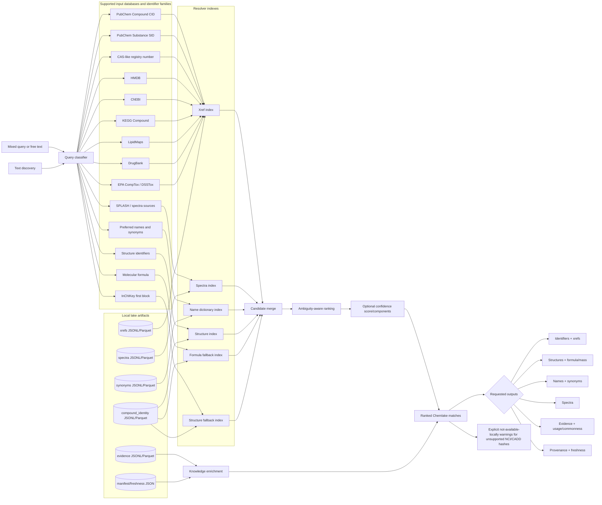

<!-- generated by scripts/generate_resolver_docs.py; edit src/chem_evidence/routing_catalog.py -->

# Chemlake resolver database routing

This document is generated from `src/chem_evidence/routing_catalog.py`. To update the graph or supported database table, edit that catalog and run:

```bash
python scripts/generate_resolver_docs.py
```

## Routing graph



## Supported databases and identifier families

| Namespace | Database / family | Accepted inputs | Local artifact(s) | Resolver route | Outputs | Notes |
| --- | --- | --- | --- | --- | --- | --- |
| pubchem_cid | PubChem Compound CID | CID:2244, 2244, pubchem_cid:2244 | compound_identity.jsonl/parquet or xrefs.jsonl/parquet | Xref index | pubchem_cid plus all compound outputs | Bare integers auto-detect as PubChem CID for CTS-Lite compatibility. |
| pubchem_sid | PubChem Substance SID | SID:12345, pubchem_sid:12345 | compound_identity.jsonl/parquet or xrefs.jsonl/parquet | Xref index | pubchem_sid plus all compound outputs | — |
| cas | CAS-like registry number | 50-78-2, cas:50-78-2 | compound_identity.jsonl/parquet or xrefs.jsonl/parquet | Xref index | cas plus all compound outputs | Only resolves when CAS-like values were ingested locally. |
| hmdb | HMDB | HMDB0001879, hmdb:HMDB0001879 | compound_identity.jsonl/parquet or xrefs.jsonl/parquet | Xref index | hmdb plus all compound outputs | — |
| chebi | ChEBI | CHEBI:15365, chebi:15365 | compound_identity.jsonl/parquet or xrefs.jsonl/parquet | Xref index | chebi plus all compound outputs | — |
| kegg | KEGG Compound | C01405, kegg:C01405 | compound_identity.jsonl/parquet or xrefs.jsonl/parquet | Xref index | kegg plus all compound outputs | — |
| lipidmaps | LipidMaps | LMFA01010001, lipidmaps:LMFA01010001 | compound_identity.jsonl/parquet or xrefs.jsonl/parquet | Xref index | lipidmaps plus all compound outputs | — |
| drugbank | DrugBank | DB00945, drugbank:DB00945 | compound_identity.jsonl/parquet or xrefs.jsonl/parquet | Xref index | drugbank plus all compound outputs | — |
| comptox | EPA CompTox / DSSTox | DTXSID5020108, DTXCID..., comptox:DTXSID... | compound_identity.jsonl/parquet or xrefs.jsonl/parquet | Xref index | comptox plus all compound outputs | — |
| splash | SPLASH / spectra sources | splash10-... | spectra.jsonl/parquet | Spectra index | splash, spectra, and linked compound outputs | SPLASH routes through spectra artifacts, then joins to compound identity. |
| name | Preferred names and synonyms | aspirin, acetylsalicylic acid | compound_identity.jsonl/parquet and synonyms.jsonl/parquet | Name dictionary index | names, synonyms, and all compound outputs | Exact name/synonym matching is default; fuzzy matching is opt-in and lower confidence. |
| structure | Structure identifiers | InChI, InChIKey, SMILES | compound_identity.jsonl/parquet | Structure index | inchi, inchikey, smiles, formula, mass, SDF/molfile when present | — |
| formula | Molecular formula | C9H8O4 | compound_identity.jsonl/parquet | Formula fallback index | formula plus ranked candidate compound outputs | Formula-only matches are intentionally lower confidence because they are often ambiguous. |
| inchikey_block1 | InChIKey first block | BSYNRYMUTXBXSQ | compound_identity.jsonl/parquet | Structure fallback index | inchikey plus ranked candidate compound outputs | Connectivity-only fallback; lower confidence than full InChIKey. |

## Route semantics

- **Xref index** — Source/database identifiers normalized by namespace and joined to compound identity.
- **Name dictionary index** — Preferred names and synonyms normalized for exact dictionary lookup; optional fuzzy fallback is explicit.
- **Structure index** — Exact InChI, InChIKey, and SMILES fields from local identity artifacts.
- **Formula fallback index** — Formula-only candidate set with ambiguity-aware lower confidence.
- **Structure fallback index** — First-block InChIKey candidate set with lower confidence than exact structure matches.
- **Spectra index** — SPLASH/spectral identifiers joined from spectra artifacts to compounds.

All request-time routing is local/offline. Remote services such as CACTUS, PubChem, CTS, HMDB, ChEBI, KEGG, LipidMaps, DrugBank, and CompTox are ingestion/backfill sources only; they are not called during `resolve`, `discover`, or `translate`.
